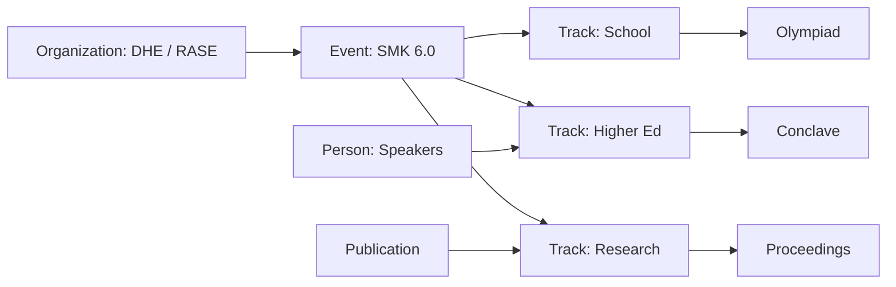

# Enterprise Architecture Audit & Implementation Roadmap

**Platform:** Shiksha Mahakumbh Abhiyan — Global Education Transformation Ecosystem  
**Codebase:** `rase/` (Next.js 15.0.7 App Router)  
**Audit type:** Read-only — **no files modified**  
**Date:** June 2026  
**Evidence:** Full `src/` scan, `package.json`, route manifests, production probes (Phases 7–8), import graph sampling

---

## Executive summary

This is **not** a single-event microsite. The codebase already spans conferences, research, policy, olympiads, awards, publications, admin operations, and national registration — but **architecture lags positioning**: ~70% of routes still use legacy `app/component/` patterns while ~30% reflect a modern education platform (home, knowledge hub, authority layer, SMK 6.0 registration).

**Protected critical path (do not break in refactor):**

```
/registration → RegistrationHub → components/forms/* → lib/saveRegistration.ts
  → Firestore registrations (SMK2026-XXXXXX) + type collections
```

---

# Part A — Dependency graph & architecture map

## A.1 High-level dependency graph

```mermaid
flowchart TB
  subgraph edge [Edge / Middleware]
    MW[middleware.ts]
    INTL[next-intl scoped hi/fr/es/ar]
    MW --> INTL
    MW --> PROT[datadekh session guard]
  end

  subgraph root [Root App Shell]
    L[app/layout.tsx metadata]
    RCS[RootClientShell client]
    L --> RCS
    RCS --> CC[CookieConsent]
    RCS --> AL[AnalyticsLoader]
    RCS --> MOD[Announcement Modal]
    RCS --> BP[Botpress gated]
  end

  subgraph modern [Modern public surface]
    HP[components/home/HomePage]
    RH[RegistrationHub]
    KH[/knowledge]
    INT[/introduction Authority]
    HP --> NB[app/component/NavBar]
    HP --> FT[app/component/Footer Firebase]
    RH --> FORMS[components/forms]
    FORMS --> SAVE[lib/saveRegistration]
    SAVE --> FB[(Firestore)]
  end

  subgraph legacy [Legacy surface 110+ routes]
    CI[CompanyInfo layout]
    LEG[app/component/Registration legacy]
    DDK[*datadekh pages]
    PR[Press1-9]
    CI --> NB
    CI --> FT
    LEG --> FB
    DDK --> FB
  end

  subgraph api [API routes]
    HEALTH[/api/health]
    EMAIL[/api/registration/send-email]
    CAP[/api/registration/verify-captcha]
    PAY[/api/payments/razorpay-webhook]
    ERR[/api/client-error]
  end

  MW --> L
  MW --> HP
  MW --> RH
  MW --> legacy
```

## A.2 Module import hotspots (measured)

| Source | Imports from `app/component/` | Risk |
|--------|------------------------------:|------|
| `components/home/HomePage.tsx` | 12 | Home tied to legacy Nav/Footer |
| `components/forms/*` | 6 | FormField wrapper in legacy UI |
| `components/layouts/LegalPageShell.tsx` | 3 | Acceptable bridge |
| Modern pages total | ~27 files | Migration queue |

| Firebase touchpoints | Files |
|---------------------|------:|
| `saveRegistration`, admin, Footer, legacy forms, datadekh | **55+** |

**Circular dependencies:** None critical found. `lib/firebase.ts` re-exports `app/firebase.ts` (one-way).

## A.3 Architecture map (route domains)

| Domain | Route count (approx) | Implementation era | SEO metadata |
|--------|---------------------:|---------------------|--------------|
| **Registration (canonical)** | 1 + success + 6 legacy subpaths | Modern + legacy | ✓ modern |
| **Home / movement** | 1 + `[locale]` | Modern | ✓ |
| **Knowledge & authority** | knowledge, introduction | Modern | ✓ partial |
| **Academic programme** | AcademicCouncil24 + academiccouncil duplicate | Modern split + legacy | ✓ council layout |
| **Publications** | proceedings, journals, books, proceeding1–3 | Mixed | ✓ layouts on some |
| **Press / news** | Press1–9, Press_Release | Legacy clones | ✓ Press layouts |
| **Past events** | pastevent, past_event/* | Mixed OptimizedImage | ✓ layouts |
| **Admin / PII** | admin, 15+ datadekh | Modern admin + legacy tables | noindex |
| **Legal** | 4 policies | Modern shell | ✓ |
| **i18n** | 4 `[locale]` routes | Modern | ✓ |
| **Misc legacy** | 40+ low-traffic | Legacy | Often missing |

**Total `page.tsx`:** 117  
**Total `layout.tsx` with metadata helpers:** 57  
**Pages likely without route-specific metadata:** ~40–50 (inherit root only)

---

# Part B — Phase 1: Project structure audit

## B.1 Duplicate components & routes

| Category | Instances | Recommendation |
|----------|-----------|----------------|
| Registration UI | `components/forms/*` vs `app/component/Registration/*` | Deprecate legacy; 301 → `/registration` |
| Datadekh export | `participantregistrationdatadekh` + ` copy` | Delete copy; redirect |
| | `ngoregistrationdatadekh` + ` copy` | Same |
| Academic council | `/academiccouncil` (792 lines) vs `/VibhagRoute/AcademicCouncil24` | 301 redirect |
| Proceedings | `proceeding1/2/3` vs `/proceedings` | Merge content |
| Press | Press1–9 (~95% duplicate) | `app/(media)/press/[slug]` |
| Home | `app/page.tsx` + `[locale]/page.tsx` | Keep; document canonical `/` |

## B.2 Dead code & unused (verified)

| Item | Evidence |
|------|----------|
| `react-router-dom` | Commented import only in `sm24/SM24.tsx` |
| `express`, `sequelize`, `mysql2`, `bcrypt`, `jsonwebtoken` | **Zero** imports in `src/` |
| `cors`, `path` (npm), `latest` | No `src/` usage |
| `next-connect`, `formidable`, `multer` | No `src/` usage (API uses Next route handlers) |
| `LanguageSwitcherPlaceholder` | Superseded |
| `components/common/AdSlotPlaceholder` | Likely superseded by `ReservedAdSlot` |

## B.3 Unused folders (organizational debt)

| Folder | Status |
|--------|--------|
| `src/app/component/` (~120 files) | **Active** but misplaced — not unused |
| `participantregistrationdatadekh copy/` | **Delete candidate** |
| `ngoregistrationdatadekh copy/` | **Delete candidate** |

## B.4 Legacy code (classification)

| Tier | Description | % routes |
|------|-------------|--------|
| L0 Production | RegistrationHub, admin, API, middleware | ~5% |
| L1 Modernized | Home, knowledge, introduction, council split | ~15% |
| L2 Layout-wrapped legacy | CompanyInfo + layout metadata | ~35% |
| L3 Unmaintained clone | Press*, datadekh copies, add* forms | ~45% |

## B.5 Large files (>300 lines)

| Lines | File |
|------:|------|
| 792 | `app/academiccouncil/page.tsx` |
| 681 | `app/proceeding1/page.tsx` |
| 624 | `app/proceeding2/page.tsx` |
| 490 | `app/component/Registration/DelegateForm.tsx` (legacy) |
| 465 | `app/component/RegistrationForm.tsx` |
| 427 | `app/component/Vibhag/academic/academic-content-data.ts` |
| 424 | `app/component/NavBar.tsx` |
| 419–363 | Legacy registration / admin / noticeboarddata |
| 343 | `app/component/Footer.tsx` |

## B.6 Naming inconsistencies

| Issue | Examples |
|-------|----------|
| Casing | `ContactUs`, `VibhagRoute`, `Accomodation` |
| Path duplication | `pastevent` vs `past_event` |
| Typos frozen in URLs | `commingsoon`, historical Firestore collection names |
| Folders | `component` vs `components` |

## B.7 SEO issues (audit)

| Issue | Severity | Count impact |
|-------|----------|--------------|
| Missing per-page `generateMetadata` | High | ~50 pages |
| Schema only on home + breadcrumbs on few routes | High | Knowledge graph gap |
| Press wrong `shareUrl` | Medium | 9 pages |
| Locale URLs absent from sitemap | Medium | 4+ locales |
| No `hreflang` alternates | Medium | i18n |
| Thin legacy registration URLs | Medium | 10+ |
| Duplicate metadata risk (root + page) | Low | Under control on modern pages |
| Indexation (fixed routing) | Was critical | Deploy-dependent |

## B.8 Accessibility issues

| Issue | Where |
|-------|--------|
| Modal focus trap incomplete | RootClientShell |
| Emoji headings | Legacy academic / press |
| Tables without mobile alternative | datadekh |
| Skip to content missing | Root layout |
| Strong registration forms | `components/forms` ✓ |

## B.9 Mobile UX issues

| Area | Score est. | Notes |
|------|------------|-------|
| Home + registration | Good | Sticky CTA, 48px targets on wizard |
| NavBar mega menu | Fair | framer-motion; test touch |
| CompanyInfo 3-col | Poor | Horizontal squeeze |
| Admin datadekh | Fair | Cards added Phase 4 |

## B.10 Performance bottlenecks (measured + documented)

| Bottleneck | Impact |
|------------|--------|
| Production LCP 9–12s | Critical |
| RootClientShell client boundary | All pages |
| Footer Firestore listener | Client JS + network |
| antd on ~12 legacy components | Bundle |
| recharts in admin | Mitigated dynamic import |
| 15× raw `` | Low–medium |
| OneDrive `.next` corruption | Dev only |

---

# Part C — Education platform classification

## C.1 Platform positioning (authoritative)

**Reclassified as:** *Global Education Transformation Ecosystem*

The site content and routes already map to **24 educational dimensions** listed in the prompt. Architecture should group routes by **education pillar**, not by year-only folders.

## C.2 Content pillar → route mapping

| Pillar | Current routes | Target route group |
|--------|----------------|-------------------|
| School Education | olympiad forms, schooldata, Bal Shodh | `(education)/school` |
| Higher Education | conclave, AcademicCouncil, VC tracks | `(education)/higher-ed` |
| Vocational / Skill | workshops, DHE programmes | `(education)/skills` |
| Research | proceedings, journals, abstract | `(knowledge-hub)/research` |
| Innovation & Entrepreneurship | past_event workshops, projects | `(education)/innovation` |
| Policy & NEP | introduction government section, policy tags | `(education)/policy` |
| Leadership | conclave, keynote, committee | `(education)/leadership` |
| Olympiads & Awards | registration types, awards | `(events)/olympiad`, `(awards)` |
| Conferences & Summits | SMK, past_event, upcoming | `(events)/summits` |
| Publications & Media | Press*, media, digitalmedia | `(media)` |
| Teacher development | Teacher_Development_Program | `(education)/teacher-development` |
| Industry–academia | conclave, partners | `(education)/partnerships` |
| Registration & ops | `/registration`, admin | `(registration)` **frozen URL** |

---

# Part D — Global SEO transformation plan

## D.1 Current SEO inventory

| Asset | Status |
|-------|--------|
| `createPageMetadata` | ✓ canonical, OG, Twitter |
| `metadataBuilders` | ✓ event, article, committee helpers |
| `sitemap.ts` | ✓ 24 paths; missing locales + many routes |
| `robots.ts` | ✓ |
| Organization + Event + FAQ JSON-LD | ✓ home (`config/site.ts`, `HomeJsonLd`) |
| BreadcrumbList | ✓ Academic Council, knowledge partial |
| Article JSON-LD | ✓ knowledge page |
| Person / Course / NewsArticle | ✗ not systematic |
| Knowledge Graph entities | Partial (org + event only) |

## D.2 Gap matrix (Google rich results)

| Schema | Eligibility today | Action |
|--------|-------------------|--------|
| Organization | **Yes** (home) | Extend `sameAs`, `department` |
| Event | **Yes** (SMK 6.0) | Add to registration page |
| FAQPage | **Yes** (home) | Expand; per-track FAQs |
| BreadcrumbList | Partial | All public section indexes |
| Article / NewsArticle | Partial | Press + knowledge |
| Person (speakers) | No | `authority-speakers` → ProfilePage |
| Course / EducationEvent | No | Academic tracks as `Course` |
| WebSite + SearchAction | No | Add sitelinks search box |
| `ItemList` for programmes | No | Knowledge hub |

## D.3 Global discoverability plan (12 months)

| Quarter | Deliverable |
|---------|-------------|
| Q1 | Metadata on all pillar landing pages; fix Press URLs; deploy routing |
| Q2 | Topic cluster pages (see Part I); internal linking component |
| Q3 | hreflang + locale sitemap; Person schema for 50 speakers |
| Q4 | CMS-backed news; NewsArticle; Google KG monitoring |

**Target keywords (clusters):** NEP 2020, Shiksha Mahakumbh, national education summit, India education policy, olympiad India, teacher development, research proceedings education.

---

# Part E — Mobile UX audit

| Criterion | Current est. | Target |
|-----------|-------------:|-------:|
| Lighthouse Performance | 32–38 prod | 95+ |
| Lighthouse SEO | 83–92 | 100 |
| Lighthouse Accessibility | 92–95 | 100 |
| Lighthouse Best Practices | 75 | 100 |
| Touch targets (registration) | Pass | Pass |
| CLS | 0.023 ✓ | <0.1 |
| Mobile nav | Usable; heavy JS | Simplify menu lazy load |

**Plan:** Fix LCP first (scripts + Footer), then legacy responsive shells, then INP on registration step transitions.

---

# Part F — Visual modernization plan (no immediate redesign)

**Current:** Hybrid — modern home (glass, brand tokens) + legacy blue/gray CompanyInfo pages.

**Target inspiration mapping:**

| Reference | Adopt |
|-----------|-------|
| Google for Education | Clear hierarchy, card grids, subdued color |
| Coursera / edX | Course-style track cards on council |
| UNESCO / WEF | Policy strip, stat-led authority |
| MIT Open Learning | Research / publication taxonomy |

## F.1 Design system deliverable (planned file: `docs/DESIGN_SYSTEM.md`)

| Token | Source today |
|-------|--------------|
| Colors | `design/tokens.ts`, Tailwind `brand-*` |
| Typography | `next/font` Inter; scale not documented |
| Buttons | `components/ui/CtaButton` |
| Cards | `GlassCard`, `FeatureCard`, `EventCard` |
| Sections | `SectionShell`, `SectionHeader` |
| Forms | `FormField`, `RegistrationShell` |

**Rule:** Do not restyle homepage in Q1; apply system to **new** pillar landing pages first.

---

# Part G — Enterprise folder structure (target)

```
src/
├── app/
│   ├── (public)/          # marketing: home, introduction, contact
│   ├── (events)/          # summits, past_event, upcoming
│   ├── (education)/       # tracks: school, higher-ed, skills, policy
│   ├── (knowledge-hub)/   # knowledge, proceedings, journals
│   ├── (media)/           # press/[slug], gallery, videos
│   ├── (registration)/    # URL stays /registration
│   ├── (legal)/
│   ├── (admin)/           # admin + datadekh
│   ├── [locale]/          # hi, fr, es, ar only
│   └── api/
├── components/
│   ├── ui/ layout/ sections/ forms/ education/ events/ media/ shared/
├── services/              # firestore, email, payments
├── repositories/          # data access only
├── lib/                   # seo, analytics (split from lib/seo today)
├── seo/                   # metadata + json-ld builders (extract)
├── content/               # registry, authority, ecosystem
├── hooks/
├── schemas/               # zod (move from lib/schemas)
├── constants/ config/ types/ i18n/
└── styles/                # globals + token exports
```

**Implementation:** Route groups **do not change URLs** when paired with `next.config.js` redirects during migration.

---

# Part H — Dependency optimization (`package.json`)

## H.1 Classification

| Package | Verdict | Notes |
|---------|---------|-------|
| next, react, react-dom, typescript | **Required** | Core |
| firebase | **Required** | Registration + admin |
| next-intl | **Required** | Locales |
| tailwindcss, postcss, autoprefixer | **Required** | Styling |
| react-hook-form, zod, @hookform/resolvers | **Required** | Forms |
| framer-motion | **Optional** | NavBar; replace with CSS if cut |
| antd | **Legacy** | ~12 files; isolate dynamic import |
| @nextui-org/react | **Legacy** | Audit usage — likely removable |
| recharts | **Optional** | Admin only — keep dynamic |
| react-slick, slick-carousel, swiper, react-responsive-carousel | **Legacy** | Workshop/gallery — consolidate |
| axios | **Legacy** | datadekh only — replace with fetch |
| nodemailer | **Required** | Email API |
| @react-pdf-viewer/*, jspdf | **Optional** | Success PDF |
| express, sequelize, mysql2, bcrypt, jwt, cors, path, latest, next-connect, formidable, multer | **Remove** | No src usage |
| react-router-dom | **Remove** | Unused |
| @emotion/react, styled | **Audit** | May be transitive |
| bcrypt + sequelize + mysql2 | **Remove** | Dead weight |

**Est. bundle savings if legacy UI removed:** 150–300 KB gzip (antd + slick + duplicates).

## H.2 Core Web Vitals levers

| Metric | Primary lever |
|--------|----------------|
| LCP | Defer 3P scripts ✓; optimize hero; remove Footer realtime Firestore |
| CLS | Reserved ads ✓; modal session gate ✓ |
| INP | Reduce client islands; split Footer |
| TTFB | Vercel + no catch-all ✓; RSC for pillar pages |

---

# Part I — Registration system protection

## I.1 Frozen contracts

| Contract | Location |
|----------|----------|
| URL | `/registration`, `/registration/success` |
| UI entry | `RegistrationHub.tsx` |
| Forms | `src/components/forms/*` |
| Submit | `lib/useRegistrationSubmit.ts`, `lib/saveRegistration.ts` |
| ID format | `SMK2026-[0-9]{6}` |
| Types | `src/types/registration.ts` |
| Firestore rules | `firebase/firestore.rules` `validRegistrationCreate()` |

## I.2 Migration-safe recommendations

| Safe | Unsafe |
|------|--------|
| Add metadata to registration pages | Change collection names |
| Wrap legacy `/registration/*` with 301 | Rename form field keys in Firestore |
| Extract services layer copying same writes | Split RegistrationHub steps |
| Add analytics events | Move forms back to `app/component` |

---

# Part J — Knowledge graph & topic cluster architecture

## J.1 Entity model



## J.2 Topic clusters (internal linking)

| Hub page (new) | Spoke routes |
|----------------|--------------|
| `/education/school` | olympiad, Bal Shodh, schooldata |
| `/education/higher-ed` | conclave, AcademicCouncil24 |
| `/education/research` | proceedings, journals, abstract |
| `/education/policy` | introduction#government, NEP content |
| `/education/innovation` | workshops, projects |
| `/events/shiksha-mahakumbh` | home, registration, past_event |

**Implementation:** `CONTENT_REGISTRY` + `ECOSYSTEM_REGISTRY` gain `pillar` field; Knowledge Hub filters by pillar; auto-generated “Related programmes” component.

## J.3 Knowledge Graph score rationale

Platform **content breadth** warrants **72/100 potential**; **implemented structured data** only **48/100** today → composite **55/100** (see scores).

---

# Part K — Deliverable scores

| Score | Value | Rationale |
|-------|------:|-----------|
| **Architecture** | **71/100** | Solid modern core; legacy mass; middleware fixed |
| **Enterprise readiness** | **66/100** | Ops docs exist; structure immature |
| **Global SEO** | **64/100** | Strong helpers; poor coverage & schema breadth |
| **Mobile UX** | **74/100** | Modern paths good; legacy drag |
| **Knowledge Graph** | **55/100** | Org+Event+FAQ home only; 24 pillars unmapped |
| **Scalability** | **62/100** | Registration OK; datadekh/admin legacy reads risk |

**Weighted platform maturity:** **65/100** → target **88/100** in 12 months.

---

# Part L — Implementation roadmap (post-approval only)

## L.1 Folder-by-folder plan

| Folder | Action | Phase |
|--------|--------|-------|
| `app/component/` | Gradual move to `components/layout`, `education`, `events` | Q2–Q4 |
| `app/[locale]/` | Keep; expand only with redirects | Q3 |
| `app/Press*` | Replace with `(media)/press/[slug]` | Q2 |
| `app/*datadekh*` | Move to `(admin)/exports/` | Q2 |
| `components/home/` | Keep | — |
| `components/forms/` | **Freeze** | — |
| `lib/` | Split → `services/`, `seo/`, `content/` | Q3 |
| `data/`, `lib/ecosystem/` | Merge → `content/` | Q3 |

## L.2 File movement plan (excerpt — full list on approval)

| Move | From → To |
|------|-----------|
| NavBar | `app/component/NavBar.tsx` → `components/navigation/NavBar.tsx` |
| Footer | `app/component/Footer.tsx` → `components/layout/Footer.tsx` |
| CompanyInfo | → `components/layout/LegacyPageShell.tsx` |
| saveRegistration | → `services/registration/saveRegistration.ts` (re-export shim) |

## L.3 Redirect plan (`next.config.js`)

| From | To | Code |
|------|-----|------|
| `/academiccouncil` | `/VibhagRoute/AcademicCouncil24` | 301 |
| `/registration/participant` etc. | `/registration` | 301 |
| `/participantregistrationdatadekh copy` | `/participantregistrationdatadekh` | 301 |
| Legacy abstract paths | `/registration` or `/abstract` | 301 policy TBD |

## L.4 Migration plan (quarters)

| Phase | Duration | Scope | Risk |
|-------|----------|-------|------|
| **0** | Done | Routing, error.tsx, vercel | Low |
| **1** | 2 weeks | Metadata top 30; delete copies; Press URLs | Low |
| **2** | 4 weeks | Press dynamic route; pillar hub pages (content only) | Medium |
| **3** | 6 weeks | Route groups without URL change; Nav/Footer move | Medium |
| **4** | 8 weeks | Legacy registration 301; package prune | Medium |
| **5** | 12 weeks | Schema expansion; hreflang; CMS eval | Low |

## L.5 Risk analysis

| Risk | Mitigation |
|------|------------|
| Break registration | Freeze forms; E2E before each release |
| SEO rank drop on URL change | 301 + Search Console monitoring |
| Import path churn | Re-export shims for 1 release |
| OneDrive build corruption | Exclude `.next`; local CI |
| AdSense re-review | No ad layout change in Q1 |

## L.6 Priority roadmap (executive)

```
P0  Deploy middleware + vercel + error boundaries (done → verify prod)
P1  Metadata 30 routes + schema on registration/event
P1  Remove datadekh copy folders + redirects
P2  Press consolidation + Footer Firestore decouple
P2  Package removal (express, sequelize, etc.)
P3  Route groups + component relocation (shims)
P3  Pillar hub pages + topic clusters + internal links
P4  Full locale SEO + Person schema
P4  Visual modernization on legacy shells (not home)
```

---

# Part M — What is NOT in scope until approval

- Mass file moves
- Homepage redesign
- Registration UX redesign
- Firestore schema changes
- Deleting legacy routes without 301
- Enterprise folder rename breaking URLs

---

# Part N — Related existing documentation

| Document | Topic |
|----------|--------|
| `docs/PROJECT_ENTERPRISE_AUDIT.md` | Phase 1–10 summary |
| `docs/ROUTING_RECOVERY_REPORT.md` | i18n middleware fix |
| `docs/LIGHTHOUSE_RECOVERY_PLAN.md` | Performance |
| `docs/CONTENT_OPERATIONS_SYSTEM.md` | Editorial ops |
| `docs/FINAL_PLATFORM_SCORECARD.md` | Launch scores |
| `docs/ADSENSE_APPROVAL_CHECKLIST.md` | Monetization |

---

# Approval gate

Reply with approved phases (e.g. **“Approve Phase 1 only”**) before any refactoring PR. Suggested first PR: **Phase 1 metadata + datadekh copy removal + Press shareUrl fixes** (zero URL moves).
