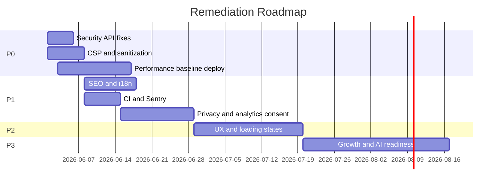

# Shiksha Mahakumbh — Remediation Roadmap

**Based on:** Enterprise Website Audit (29 May 2026)  
**Production:** https://www.rase.co.in  
**Status:** Active remediation

---

## Overview

This roadmap sequences **47 audit findings** across four priority tiers over **12 weeks**, aligned with SMK 6.0 campaign readiness. Work is grouped into **security hardening**, **performance**, **compliance**, and **growth** tracks.

---

## Phase 0 — P0 Critical (Week 1)

**Goal:** Close exploitable security gaps and begin performance recovery.  
**Exit criteria:** v2 API parity with legacy guards; CSP deployed; DOMPurify on CMS HTML; smoke tests 14/14.

| ID | Finding | Effort | Owner track |
|----|---------|--------|-------------|
| 6.1 / 7.1 / 11.1 | v2 registration submit lacks payment verification | Medium | Security |
| 6.2 | v2 upload allows client-selected admin buckets | Small | Security |
| 6.3 | No CSP; CMS `dangerouslySetInnerHTML` unsanitized | Large | Security |
| 5.1 | LCP 9–12s (Performance 32–38) | Large | Performance |

**Dependencies:** None for security items. Performance depends on deploy pipeline (Phase 0 must not break registration).

**Blockers:** Upstash optional for rate limits (not P0). Legal review not required for technical security fixes.

---

## Phase 1 — P1 High (Weeks 2–4)

**Goal:** SEO/i18n correctness, analytics compliance, CI gates, observability.

| Theme | Key items | Effort |
|-------|-----------|--------|
| SEO | Hreflang on all 4 locale pairs; homepage SEO 83 → 92+; OG locale for Hindi | Small–Medium |
| Accessibility | Dynamic `html lang`; `#main-content` on all shells | Small |
| Compliance | Privacy policy update; first-party analytics consent; newsletter unsubscribe | Medium |
| DevOps | CI workflow (typecheck, lint, test, build); Sentry wiring | Medium |
| Security | Upstash rate limits; npm audit remediation; ADMIN_OPS_SECRET rotation policy | Medium |
| Performance | Phase 5/6 script deferral deploy; OptimizedImage migration | Large |

**Dependencies:** P0 security complete before ADMIN_OPS_SECRET rotation comms. Privacy policy needs legal sign-off before analytics consent UI changes.

**Blockers:** Legal review for privacy policy (1–2 weeks external).

---

## Phase 2 — P2 Medium (Weeks 5–8)

**Goal:** UX polish, retention, schema cleanup, operational maturity.

- App Router `loading.tsx` for top routes
- Cookie preference center
- Data retention cron for visitor analytics
- FAQ public page
- Footer server-side CMS (no hydration swap)
- Marquee pause control; nav `<button>` dropdowns
- JSON-LD consolidation on contact page
- Sitemap `lastModified` from CMS `updatedAt`
- Hindi content OR remove Hindi routes from sitemap

**Dependencies:** P1 analytics consent before retention job semantics.

---

## Phase 3 — P3 Low (Weeks 9–12)

**Goal:** Growth and AI readiness.

- Social share on registration success
- Entity directory pages (`/people`, `/institutions`)
- Knowledge graph JSON export endpoint
- ScholarlyArticle schema on proceedings
- A/B testing via GTM experiments
- Remove orphan `metadata.tsx` and dead locale routes

---

## Milestone Timeline

---

## Success Metrics

| Metric | Current (May 2026) | Target (Post-P1) | Target (Post-P2) |
|--------|-------------------|------------------|------------------|
| Lighthouse Performance | 32–38 | 70–85 | 90+ |
| Lighthouse Accessibility | 92–95 | 95+ | 100 |
| Lighthouse SEO | 83–92 | 95+ | 100 |
| Smoke tests | 14/14 | 14/14 | 14/14 + CI |
| Critical npm CVEs | 3 | 0 | 0 |
| v2 API security parity | No | Yes | Yes |

---

## Risk Register

| Risk | Likelihood | Impact | Mitigation |
|------|------------|--------|------------|
| CSP breaks Razorpay/GTM | Medium | High | Staged rollout; report-only first in preview |
| Performance work breaks registration | Low | Critical | No changes to legacy submit path; smoke + E2E |
| Hindi route removal angers stakeholders | Medium | Medium | Ship translations instead of removal |
| Legal review delays privacy update | High | Medium | Interim consent banner disclosure |

---

*Last updated: 29 May 2026*
