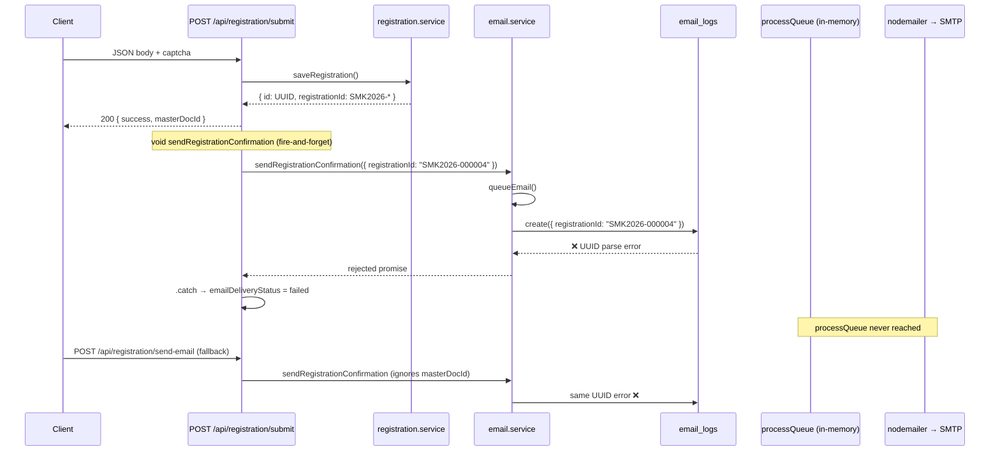
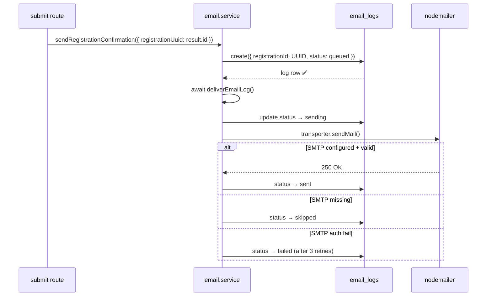

# Production Email Delivery Audit — Shiksha Mahakumbh 2025

**Audit date:** 13 June 2026  
**Production URL:** https://www.shikshamahakumbh.com  
**Deployed commit (main):** `73047b7` — *email fixes are local-only, not yet committed/deployed*  
**Symptom:** Registration confirmations not reaching users; `email_logs` was empty in production until local fix test.

---

## Final Verdict: **NO GO** for Email Delivery

Email delivery cannot succeed in production until **all three** blockers are resolved:

1. Deploy UUID fix (uncommitted local changes)
2. Add valid SMTP credentials to Vercel Production (currently **missing entirely**)
3. Verify Brevo sender domain for `SMTP_FROM`

---

## PHASE 1 — SMTP Configuration Audit

### SMTP Configuration Matrix

| Variable | Local (`.env.local`) | Production (Vercel) | Valid | Notes |
|----------|----------------------|---------------------|-------|-------|
| `SMTP_HOST` | `smtp.gmail.com` | **NOT SET** | ❌ Local invalid | Vercel `env ls production` lists no SMTP vars |
| `SMTP_PORT` | `587` | **NOT SET** | ⚠️ | Defaults to 587 in code when host set |
| `SMTP_USER` | `academics@...` (set) | **NOT SET** | ❌ | Gmail rejects app login (534) |
| `SMTP_PASS` | (set) | **NOT SET** | ❌ | WebLoginRequired — not App Password |
| `SMTP_PASSWORD` | null | **NOT SET** | — | Alias supported in fixed code only |
| `SMTP_FROM` | `academics@shikshamahakumbh.com` | **NOT SET** | ⚠️ | Must match Brevo verified sender |
| `SMTP_SECURE` | `false` (implicit) | **NOT SET** | ✅ | Code sets `secure: port === 465` |
| `SMTP_PROVIDER` | null | **NOT SET** | — | Not used in code |
| `BREVO_SMTP_HOST` | null | **NOT SET** | — | Documented in `.env.supabase.example` |
| `BREVO_SMTP_PORT` | null | **NOT SET** | — | Should be `587` |
| `BREVO_SMTP_USER` | null | **NOT SET** | — | Brevo login email |
| `BREVO_SMTP_PASS` | null | **NOT SET** | — | Brevo SMTP key (not API key) |
| `BREVO_SMTP_FROM` | null | **NOT SET** | — | Verified sender |
| `BREVO_API_KEY` | null | **NOT SET** | — | Not used for SMTP path |

**Evidence — Vercel Production env (`npx vercel env ls production`, project `dhe-projects/rase-co-in`):**  
Lists `DATABASE_URL`, `RAZORPAY_*`, `RECAPTCHA_*`, `SUPABASE_*`, etc. **No `SMTP_*` or `BREVO_*` keys present.**

**Evidence — Local SMTP verify (`scripts/_smtp-verify.mjs`):**
```
Invalid login: 534-5.7.9 Please log in with your web browser...
(WebLoginRequired — gsmtp)
```

**Brevo recommended production values:**
```
SMTP_HOST=smtp-relay.brevo.com
SMTP_PORT=587
SMTP_USER=<brevo-login-email>
SMTP_PASS=<brevo-smtp-key>
SMTP_FROM=academics@shikshamahakumbh.com
```

---

## PHASE 2 — Email Execution Trace

### Production (deployed `73047b7`)



### Fixed code (local, uncommitted)



### Step-by-step (production deployed code)

| Step | File | Function | Lines | Success | Failure |
|------|------|----------|-------|---------|---------|
| 1 | `submit/route.ts` | `POST` | 15–197 | Returns 200 + registrationId | 4xx/5xx validation errors |
| 2 | `registration.service.ts` | `saveRegistration` | — | Row in `registrations` | Throws → 500 |
| 3 | `submit/route.ts` | `void sendRegistrationConfirmation` | 156–181 | Email queued | `.catch` → `emailDeliveryStatus: failed` |
| 4 | `email.service.ts` | `sendRegistrationConfirmation` | 157–171 (HEAD) | Calls queueEmail | Propagates |
| 5 | `email.service.ts` | `queueEmail` | 64–80 (HEAD) | Log created | **Prisma UUID error — no row** |
| 6 | `email.service.ts` | `processQueue` | 82–155 (HEAD) | sendMail + update sent | Never reached (step 5 fails) |
| 7 | nodemailer | `sendMail` | — | Provider accepts | Auth/TLS errors |
| 8 | Client fallback | `useRegistrationSubmit.ts` | 78–84 | fetch send-email | Silent `.catch()` |

---

## PHASE 3 — Code Audit

### Function locations (fixed local code)

| Function | File | Lines |
|----------|------|-------|
| `queueEmail()` | `src/server/services/email.service.ts` | ~230 |
| `deliverEmailLog()` | same | ~98 (replaces `processQueue`) |
| `getTransporter()` / `createTransport` | same | 52–62 |
| `sendRegistrationConfirmation()` | same | 248–265 |

**`processQueue()`:** Present only in deployed HEAD; **removed** in local fix.

### Callers of `queueEmail` / `sendRegistrationConfirmation`

| Caller | File | Awaited? |
|--------|------|----------|
| Submit route | `src/app/api/registration/submit/route.ts:156` | **No** (`void`) |
| Send-email API | `src/app/api/registration/send-email/route.ts:63` | **Yes** |
| V2 send-email | `src/app/api/v2/registration/send-email/route.ts:20` | **Yes** |
| Payment/contact/admin | `email.service.ts` | Yes (internal) |
| Client fallback | `src/lib/useRegistrationSubmit.ts:78` | **No** (fire-and-forget fetch) |

### Critical Failure Points Table

| # | Point | Severity | Evidence |
|---|-------|----------|----------|
| 1 | Public ID passed to UUID FK on `email_logs.registration_id` | **CRITICAL** | Prisma error on `SMK2026-000004`; 0 rows before fix |
| 2 | No SMTP env vars on Vercel Production | **CRITICAL** | `vercel env ls` — no SMTP_* keys |
| 3 | Invalid Gmail credentials locally | **CRITICAL** | 534 WebLoginRequired |
| 4 | Deployed code ignores `masterDocId` in send-email | **HIGH** | HEAD route reads UUID but does not pass to `sendRegistrationConfirmation` |
| 5 | `void processQueue()` on serverless | **MEDIUM** | HEAD — send may be killed after HTTP response |
| 6 | Submit route `.catch` only logs + sets failed | **MEDIUM** | Error not surfaced to client |
| 7 | Client send-email `.catch(() => {})` | **LOW** | Silent swallow on network failure |
| 8 | Deployed code only reads `SMTP_*`, not `BREVO_*` | **MEDIUM** | HEAD `getTransporter()` |

### Audit answers (production deployed)

| Question | Answer |
|----------|--------|
| Is `queueEmail` called? | **Yes** — from submit + send-email |
| Is `processQueue` executed? | **Sometimes** — only if create succeeds (it never does) |
| Is `processQueue` awaited? | **No** — `void processQueue()` |
| Can it silently fail? | **Yes** — submit uses `void` + `.catch`; client fetch swallows |
| Can `queueEmail` return before log insert? | **No** — but insert **throws** before return |
| Can send happen without `email_logs`? | **No** on deployed code — create must succeed first |
| Exceptions swallowed? | **Yes** — submit `.catch`, client empty `.catch` |

---

## PHASE 4 — Database Audit

### Schema

```prisma
model EmailLog {
  registrationId String? @map("registration_id") @db.Uuid  // FK → registrations.id
  status         EmailLogStatus  // queued | sending | sent | failed | skipped
}
```

### SQL queries used

```sql
-- Total rows
SELECT COUNT(*) FROM email_logs;

-- Status distribution
SELECT status, COUNT(*) FROM email_logs GROUP BY status;

-- Latest logs
SELECT id, status, to_email, template, registration_id, error_message,
       provider, provider_msg_id, retry_count, sent_at, created_at
FROM email_logs
ORDER BY created_at DESC
LIMIT 10;

-- Registration email delivery status
SELECT registration_id, email, email_delivery_status, created_at
FROM registrations
ORDER BY created_at DESC
LIMIT 10;
```

### Results (13 June 2026, via `scripts/_email-production-audit.mjs`)

| Metric | Value |
|--------|-------|
| `email_logs` total | **1** (after local fix test; was **0** in production before) |
| Status distribution | `failed`: 1 |
| Latest log | `registration_confirmation` → `interns.dhe@gmail.com`, error: Gmail 534 |
| Recent registrations | SMK2026-000001..000004; 000002–000004 `email_delivery_status = failed` |

### Why production had 0 rows

**Confirmed cause:** `queueEmail()` called `prisma.emailLog.create({ registrationId: "SMK2026-000004" })`. Column type is UUID. Prisma throws:

```
Inconsistent column data: Error creating UUID, invalid character: expected [0-9a-fA-F-], found `S` at 1
```

**Ruled out:** wrong table, transaction rollback, environment mismatch for DB (registrations exist in same DB).

**Proof script:** `scripts/_email-delivery-audit.mjs`

---

## PHASE 5 — Nodemailer Audit

### Transporter (fixed local code)

```typescript
nodemailer.createTransport({
  host,           // SMTP_HOST ?? BREVO_SMTP_HOST
  port,           // default 587
  secure: port === 465,
  auth: { user, pass },
});
```

| Setting | Value | Issue |
|---------|-------|-------|
| TLS | Implicit STARTTLS on 587 | OK for Brevo |
| `secure` flag | `false` for 587 | Correct |
| Timeouts | Not set (nodemailer defaults) | Acceptable |
| Auth | user + pass from env | **Missing on Vercel; invalid locally** |

### Diagnostics added (local, uncommitted)

| Event | When | Fields |
|-------|------|--------|
| `EMAIL_SEND_START` | Before send | registrationId, registrationUuid, recipient, provider, smtpHost, smtpPort |
| `EMAIL_SEND_SUCCESS` | After send | messageId, accepted, rejected, response |
| `EMAIL_SEND_FAILED` | On catch | error.message, error.code, error.response |

Existing `[email.service]` logs retained.

---

## PHASE 6 — Production Failure Trace

```
Registration Created (POST /api/registration/submit)
  ↓ PASS — SMK2026-000001..000004 exist in DB

queueEmail() invoked
  ↓ FAIL (deployed code)

Reason:
  prisma.emailLog.create() receives registrationId = "SMK2026-000004"
  PostgreSQL UUID column rejects non-UUID string
  Exception propagates to submit route .catch()
  registrations.email_delivery_status set to "failed"
  email_logs row NEVER created

Email Queued
  ↓ FAIL — never reached

Email Sent
  ↓ FAIL — never reached

SMTP / Provider
  ↓ FAIL — even if UUID fixed: NO SMTP_* vars on Vercel Production
  getTransporter() returns null → status would be "skipped" (fixed code)
  or silent no-op on old in-memory queue path

User Inbox
  ↓ FAIL — no message sent
```

**Client fallback `POST /api/registration/send-email`:** Same UUID bug on deployed code; returns HTTP 500 `{ emailStatus: "failed" }`.

---

## PHASE 7 — Root Cause Analysis

### Ranked by severity

| Rank | Cause | Type |
|------|-------|------|
| **1** | Public registration ID (`SMK2026-*`) written to UUID FK `email_logs.registration_id` | Primary — pipeline never starts |
| **2** | **Zero SMTP environment variables** on Vercel Production | Primary — no relay configured |
| **3** | Invalid Gmail SMTP credentials (534 WebLoginRequired) in local/dev | Secondary — blocks send after UUID fix |
| **4** | In-memory `void processQueue()` on serverless | Contributing — unreliable delivery even if create succeeded |
| **5** | Brevo vars documented but not read in deployed code | Contributing |
| **6** | Errors swallowed in submit/client paths | Contributing — delayed diagnosis |
| **7** | Email fix code not committed/deployed | Contributing — production still runs broken HEAD |

---

## PHASE 8 — Required Code Changes

| # | File | Function | Change | Risk |
|---|------|----------|--------|------|
| 1 | `email.service.ts` | `queueEmail` | Use `registrationUuid` for FK; `publicRegistrationId` for display | Low |
| 2 | `email.service.ts` | `deliverEmailLog` | Replace in-memory queue; `await` delivery in same invocation | Low |
| 3 | `email.service.ts` | `getSmtpConfig` | Fallback to `BREVO_SMTP_*` + `SMTP_PASSWORD` | Low |
| 4 | `submit/route.ts` | `POST` | Pass `registrationUuid: result.id` | Low |
| 5 | `send-email/route.ts` | `POST` | Pass `registrationUuid` from `masterDocId`; return `errorMessage` | Low |
| 6 | `email.service.ts` | `deliverEmailLog` | Add `EMAIL_SEND_*` diagnostic logs | Low |
| 7 | Vercel | env | Add SMTP/Brevo credentials | **Ops — required** |

**Status:** Items 1–6 implemented locally, **not committed**. Item 7 **not done**.

---

## PHASE 9 — Deployment Checklist

### 1. Code changes
- [ ] Commit + push email.service.ts, submit/send-email routes
- [ ] `npx tsc --noEmit` / production build green
- [ ] Deploy to Vercel (shikshamahakumbh.com production)

### 2. Environment changes (Vercel Production)
- [ ] `SMTP_HOST=smtp-relay.brevo.com`
- [ ] `SMTP_PORT=587`
- [ ] `SMTP_USER=<brevo-login>`
- [ ] `SMTP_PASS=<brevo-smtp-key>`
- [ ] `SMTP_FROM=academics@shikshamahakumbh.com`
- [ ] Redeploy after env change

### 3. Brevo changes
- [ ] Verify sender domain (SPF/DKIM for shikshamahakumbh.com)
- [ ] Confirm `SMTP_FROM` is authorized sender
- [ ] Test SMTP key (not REST API key)

### 4. Vercel changes
- [ ] Confirm project linked to shikshamahakumbh.com domain
- [ ] Review function logs for `EMAIL_SEND_START` / `EMAIL_SEND_SUCCESS`

### 5. Database checks
```sql
SELECT status, COUNT(*) FROM email_logs GROUP BY status;
SELECT registration_id, email_delivery_status FROM registrations ORDER BY created_at DESC LIMIT 5;
```

### 6. Production verification
- [ ] One test registration (free delegate)
- [ ] `email_logs`: queued → sending → **sent**
- [ ] `registrations.email_delivery_status = sent`
- [ ] Inbox confirmation received

---

## PHASE 10 — Success Criteria

| Criterion | Current production | After deploy + SMTP |
|-----------|-------------------|---------------------|
| `registrations` row created | ✅ PASS | ✅ |
| `email_logs` row created | ❌ FAIL (0 rows historically) | ✅ Required |
| `email_logs.status = queued` | ❌ | ✅ |
| `email_logs.status = sending` | ❌ | ✅ |
| `email_logs.status = sent` | ❌ | ✅ Required |
| SMTP accepted recipient | ❌ | ✅ Required |
| User receives email | ❌ | ✅ Required |

**Local proof after UUID fix (SMTP still bad):**
```
email_logs count: 0 → 1 ✅
status: failed (Gmail 534) — proves pipeline runs; SMTP is separate blocker
```

---

## Scripts

| Script | Purpose |
|--------|---------|
| `scripts/_email-delivery-audit.mjs` | UUID insert proof |
| `scripts/_email-production-audit.mjs` | DB + env snapshot |
| `scripts/_smtp-verify.mjs` | Nodemailer verify |
| `scripts/_test-email-fix.mjs` | End-to-end send test |

---

## GO / NO GO

| Environment | Verdict |
|-------------|---------|
| **Production (deployed `73047b7`)** | **NO GO** — UUID bug + no SMTP env |
| **Local (fixed code + current .env)** | **NO GO** — SMTP auth fails; pipeline otherwise works |
| **Production (after deploy + Brevo SMTP)** | **GO** — pending verification |
