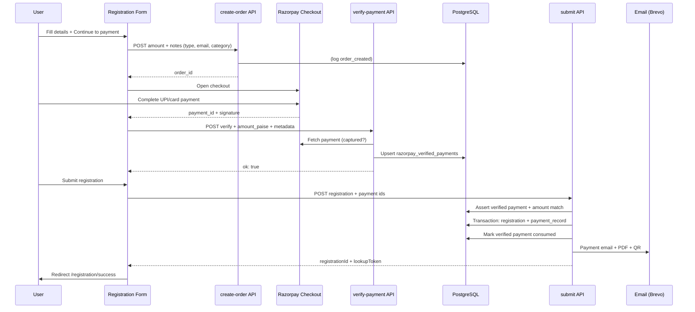
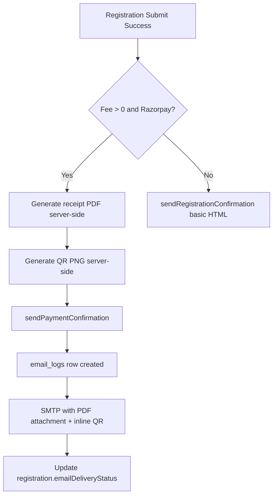

# Registration–Payment–Email Workflow Fix (2026-06-14)

## 1. Root Cause Analysis

### A. Registration not saved after successful payment
| Issue | Root cause |
|-------|------------|
| Payment verified but registration missing | Flow was **Pay → Submit** with no server-side payment ledger. If submit failed (captcha, validation, network, tab closed), money was captured but no DB row existed. |
| No idempotency | Retrying submit after a partial failure could create duplicates or fail silently. |
| Webhook could not recover | Webhook only links payments to **existing** registrations via `order_id` / notes — orders were created without registration context. |
| Verify endpoint was stateless | `/api/payments/verify-payment` only checked HMAC signature; nothing persisted. |

### B. Category switch shows wrong form (e.g. Projects stuck)
| Issue | Root cause |
|-------|------------|
| Stale category after switching | `RegistrationHub` ran `loadMeta()` on every `currentFee` change. When Accommodation form loaded and fee updated (0 → 3000), meta was re-read from `localStorage` and **restored the previous Projects category**. |
| Form instance reuse | `GenericRegistrationForm` is shared across paid categories; without a `key` on the router, React could reuse component state. |

### C. Razorpay "Business - Website Mismatch"
| Issue | Root cause |
|-------|------------|
| Failed payments in dashboard | Razorpay rejects checkout when the **browser origin** is not whitelisted in merchant settings. Not a code bug — configuration issue. |
| Contributing env drift | Local `.env` had `NEXT_PUBLIC_SITE_URL=https://shikshamahakumbh.org` while production canonical domain is `shikshamahakumbh.com`. |

**Note:** Website Mismatch failures do **not** capture payment. The ₹1,000 Captured payment (SMK2026-000003) succeeded from a whitelisted domain.

---

## 2. Files Modified

| File | Change |
|------|--------|
| `prisma/schema.prisma` | Added `RazorpayVerifiedPayment` model |
| `prisma/migrations/20250614_razorpay_verified_payments/migration.sql` | DB migration |
| `src/server/services/razorpay-verified.service.ts` | **New** — verify, persist, consume payments |
| `src/server/services/receipt.service.ts` | **New** — server-side PDF + QR generation |
| `src/lib/razorpay/handlers.ts` | Structured logging; verify persists to DB; Razorpay API capture check |
| `src/app/api/registration/submit/route.ts` | Payment gate, idempotency, paid email with attachments |
| `src/server/services/email.service.ts` | Attachments; rich payment confirmation HTML |
| `src/app/registration/RegistrationHub.tsx` | Meta load once; category switch fix; form `key` |
| `src/lib/registration/draftStorage.ts` | `switchRegistrationCategory()` helper |
| `src/components/payments/RazorpayCheckout.tsx` | Order notes + verify metadata |
| `src/components/forms/FormField.tsx` | `PaymentBlock` order notes |
| `src/components/forms/GenericRegistrationForm.tsx` | Order notes per category |
| `src/lib/useRegistrationSubmit.ts` | Duplicate payment → success redirect |
| `.env.example` | Razorpay domain whitelist documentation |

---

## 3. Bug Fixes Implemented

1. **Verified payment ledger** — Every successful Razorpay verify is stored in `razorpay_verified_payments` with signature, amount, and metadata.
2. **Submit requires verified payment** — Paid online registrations must have a matching verified payment before DB insert.
3. **Idempotent submit** — If `razorpay_payment_id` already linked to a registration, returns existing ID (safe retry).
4. **Remote capture check** — Verify calls Razorpay API to confirm `status === captured`.
5. **Category switch** — Meta restored only on first mount; category change writes new meta immediately; form remounts via `key={registrationType}`.
6. **Payment confirmation email** — PDF receipt attachment, embedded QR (`cid:registration-qr`), registration ID, transaction ID, amount, category, receipt link.
7. **Structured logging** — `PAYMENT_FLOW`, `REGISTRATION_SUBMIT`, existing `EMAIL_*` events.

---

## 4. Updated Payment Flow



---

## 5. Updated Email Flow



**Paid email includes:** Registration ID, Transaction ID, Amount, Category, receipt download link, PDF attachment, embedded QR.

---

## 6. Database Changes Required

Run on production **before or with deploy**:

```bash
npx prisma migrate deploy
# or apply: prisma/migrations/20250614_razorpay_verified_payments/migration.sql
```

New table: `razorpay_verified_payments` — no changes to existing registration rows.

---

## 7. Razorpay Dashboard Actions (Manual)

In **Razorpay → Account & Settings → Website / Business**, whitelist:

- `https://www.shikshamahakumbh.com`
- `https://shikshamahakumbh.com`
- `https://www.rase.co.in`
- `https://rase.co.in`

Set Vercel production: `NEXT_PUBLIC_SITE_URL=https://www.shikshamahakumbh.com`

Ensure **live mode** keys match dashboard (Test Mode off for production).

Configure webhook URL: `https://www.shikshamahakumbh.com/api/payments/razorpay-webhook` with `RAZORPAY_WEBHOOK_SECRET`.

---

## 8. Testing Checklist

- [ ] Run DB migration on staging/production
- [ ] Projects (₹200): pay → submit → registration in admin → email with PDF + QR
- [ ] Accommodation (₹3000): same flow; PAN required
- [ ] Switch Projects → Accommodation → form shows Accommodation fields (not Projects)
- [ ] Retry submit with same payment_id → returns existing registration (no duplicate)
- [ ] Submit without verify → 400 "Payment not verified"
- [ ] Free category (Delegate free tier) → registration email only, no payment email
- [ ] Manual UTR upload path still works (no Razorpay verify required)
- [ ] Razorpay dashboard: payment from `www.shikshamahakumbh.com` → Captured (not Website Mismatch)
- [ ] Check logs: `PAYMENT_FLOW`, `REGISTRATION_SUBMIT`, `EMAIL_SEND_SUCCESS`

---

## 9. Backward Compatibility

- Existing registrations (SMK2026-000001..000004) unchanged.
- Manual/offline payment (UTR + receipt upload) unchanged — verify ledger only applies when `razorpayPaymentId` is present.
- Free registrations still receive basic confirmation email.
- Client-side receipt PDF/QR on success page unchanged.
- Webhook handler unchanged; now more useful once orders include notes.
