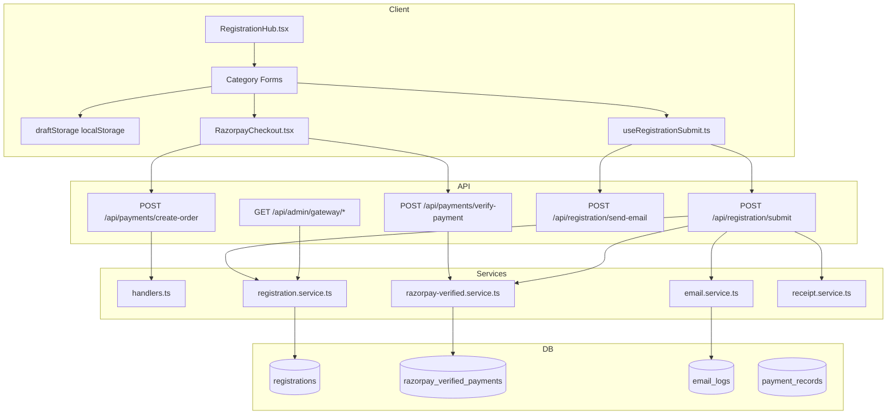
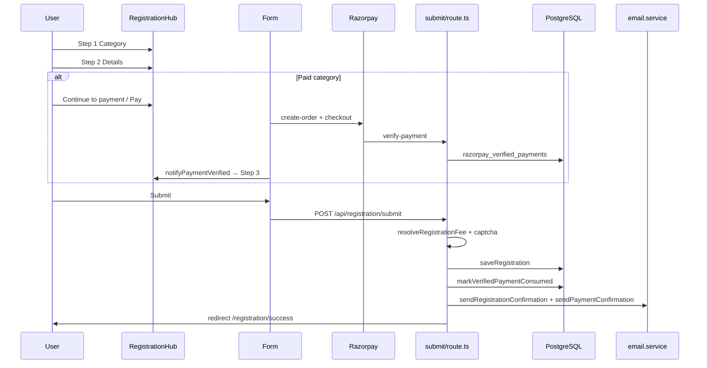
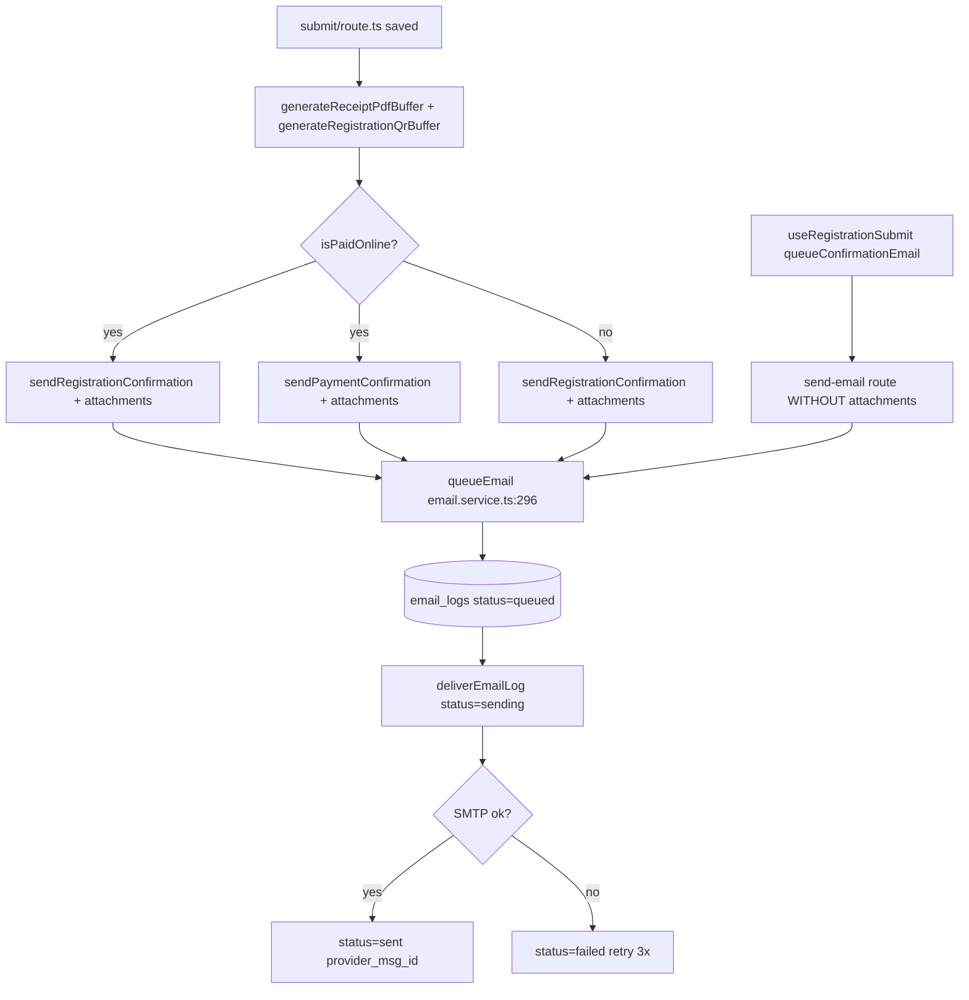
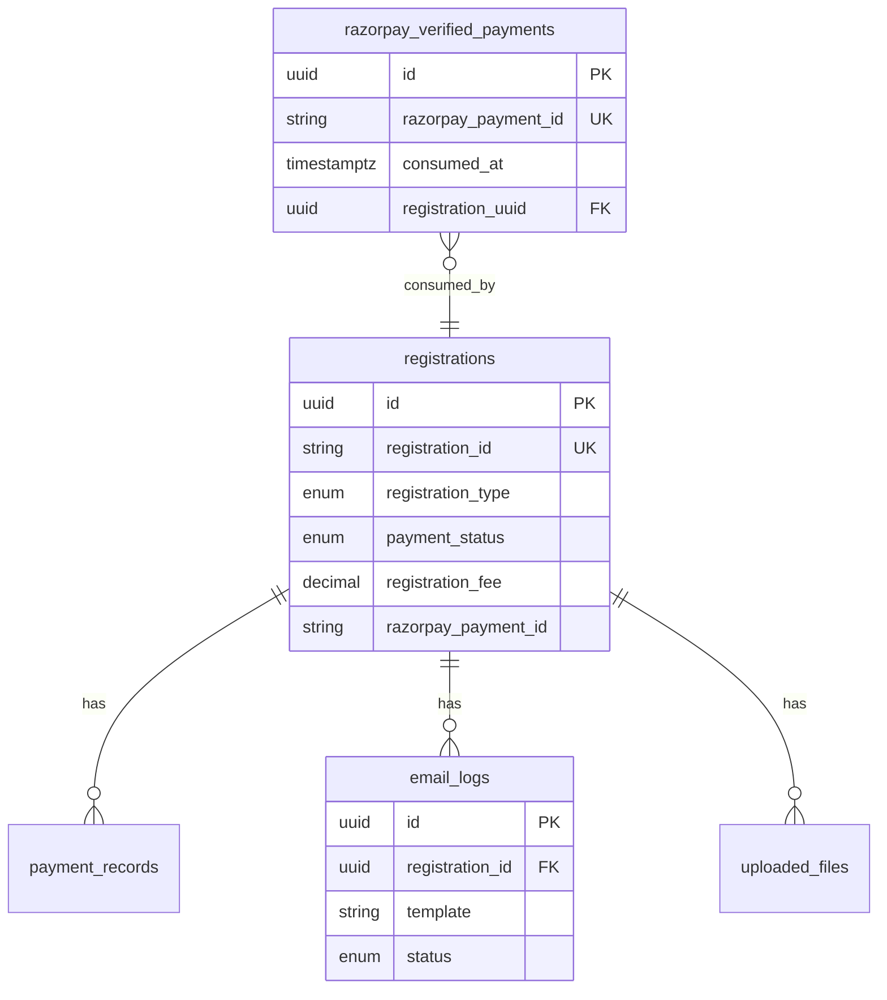

# Shiksha Mahakumbh 2026 — Production Certification Audit

**Date:** 2026-06-16  
**Auditor scope:** Code-path audit (not live E2E unless noted)  
**Production URL:** https://www.shikshamahakumbh.com  
**Deployed commit:** `7d0ffef`

---

## Executive Summary

The registration, payment, email, receipt, QR, and admin systems are **substantially production-ready** after recent fixes. Category sticking, fee validation, admin Decimal serialization, and dual-email attachment logic are **verified in code**.

**Remaining production risks:** duplicate confirmation emails, Olympiad fee/submit mismatch, orphan payments if users abandon after pay, in-memory rate limiting on serverless, admin UI swallowing detailed errors, receipt PDF differing from on-screen HTML receipt, QR payload missing `registrationType`.

**Verdict:** **CONDITIONAL GO** — safe for paid Projects/Accommodation/Delegate flows with manual post-deploy E2E; fix Olympiad and duplicate-email before high-traffic launch.

---

## 1. Architecture Diagram



---

## 2. Registration Flow Diagram



---

## 3. Payment Flow Diagram

```mermaid
flowchart LR
  A[Client amountInRupees] --> B[create-order handlers.ts:104-117]
  B -->|notes.registrationType| C[expectedAmountPaiseFromOrderNotes]
  C -->|reject mismatch| X[400]
  C -->|ok| D[Razorpay Order]
  D --> E[Checkout handler]
  E --> F[verify-payment]
  F --> G[recordVerifiedPayment razorpay-verified.service.ts:31-138]
  G --> H[(razorpay_verified_payments consumed_at=null)]
  H --> I[User clicks Submit]
  I --> J[assertVerifiedPaymentForSubmit :141-205]
  J --> K[saveRegistration]
  K --> L[markVerifiedPaymentConsumed :208-227]
```



---

## 4. Email Flow Diagram



---

## 5. Database Relationship Diagram



---

## 6. Phase 1 — Registration Category Matrix

| Category | Hub Form | Fee | Payment Required | Submit (code) | Email (code) | Admin (code) | Notes |
|----------|----------|-----|------------------|---------------|--------------|--------------|-------|
| Delegate Registration | DelegateForm.tsx | ₹0–₹8000 by category | If fee > 0 | **PASS** | **PASS** | **PASS** | 3-step when paid |
| Conclave | ConclaveForm.tsx | Free | No | **PASS** | **PASS** | **PASS** | |
| Projects | GenericRegistrationForm requiresPayment | ₹200 / ₹400 | Yes | **PASS** | **PASS** dual | **PASS** | Prisma type = Exhibition |
| Accommodation | GenericRegistrationForm requiresPayment | ₹3000 / ₹6000 | Yes | **PASS** | **PASS** dual | **PASS** | |
| Awards | AwardsForm.tsx | Free | No | **PASS** | **PASS** | **PASS** | |
| Best Practices | BestPracticeForm.tsx | Free | No | **PASS** | **PASS** | **PASS** | |
| Olympiad | OlympiadForm.tsx | ₹200/student calculated | UI: "no payment" | **FAIL** | N/A | **PASS** | See Bug #2 |
| Exhibition | GenericRegistrationForm | Free | No | **PASS** | **PASS** | **PASS** | |
| Bal Shodh Patrika | GenericRegistrationForm | Free | No | **PASS** | **PASS** | **PASS** | |
| Cultural Program | GenericRegistrationForm | Free | No | **PASS** | **PASS** | **PASS** | |
| Multi Track Conference | External CMT redirect | N/A | N/A | **N/A** | N/A | N/A | config.ts:8-10 |
| Participant | /registration/participant → redirect | N/A | N/A | **N/A** | N/A | N/A | Not on hub |
| Talent | /registration/talent → redirect | N/A | N/A | **N/A** | N/A | N/A | Not on hub |
| NGO | /registration/ngo → redirect | N/A | N/A | **N/A** | N/A | N/A | Not on hub |
| Volunteer | /registration/volunteer → redirect | N/A | N/A | **N/A** | N/A | N/A | Not on hub |

**Evidence:** Hub routing `RegistrationHub.tsx:52-102`; fee resolution `fees.ts:30-51`; submit validation `submit/route.ts:105-130`.

---

## 7. Phase 2 — Category Sticking Audit

### Fixes verified PASS

| Control | File | Lines | Status |
|---------|------|-------|--------|
| Meta no longer forced to step 2 on autosave | draftStorage.ts | 22-29 | **PASS** |
| Category switch clears prior draft | RegistrationHub.tsx | 217-218 | **PASS** |
| switchRegistrationCategory resets meta step 1 | draftStorage.ts | 62-69 | **PASS** |
| Change category clears meta | RegistrationHub.tsx | 252-255 | **PASS** |
| Form remount on type change | RegistrationHub.tsx | 276 `key={registrationType}` | **PASS** |
| Projects/Accommodation always 3-step | config.ts | 41-47 | **PASS** |

### Remaining risks

| Risk | Severity | Root cause | File:Line |
|------|----------|------------|-----------|
| Page reload restores last category + step from meta | **Medium** | `loadMeta()` auto-rehydrates | RegistrationHub.tsx:153-166 |
| "Change category" does not clear current type draft | **Low** | Only `clearRegistrationMeta()`, not `clearDraft()` | RegistrationHub.tsx:252-255 |
| Stale Projects draft reappears if user re-selects Projects | **Low** | Draft keyed per type intentionally | useRegistrationDraft.ts:14-19 |
| `currentFee` hydration race on first paint | **Low** | meta effect depends on `currentFee` | RegistrationHub.tsx:166 |

**Category sticking bug (original):** **VERIFIED PASS** for primary fix path (switch category + clear meta + clear draft on change).

---

## 8. Phase 3 — Payment Audit

| Check | Status | Evidence |
|-------|--------|----------|
| Server fee validation on create-order | **PASS** | handlers.ts:104-117 |
| Server fee validation on submit | **PASS** | submit/route.ts:105-130 (Olympiad exempt) |
| Signature verification | **PASS** | razorpay-verified.service.ts:37-52 |
| Duplicate payment → registration blocked | **PASS** | razorpay-verified.service.ts:87-103, 173-185 |
| consumed_at on successful submit | **PASS** | submit/route.ts:221-227 |
| Orphan if pay without submit | **RISK** | Architectural two-step; mitigated by recovery |
| create-order without notes | **MEDIUM** | Fee check skipped if no notes.handlers.ts:104 |
| verify-payment amount not re-validated vs fee | **LOW** | Amount stored; submit validates |

---

## 9. Phase 4 — Email Audit

| Check | Status | Evidence |
|-------|--------|----------|
| email_logs row always created | **PASS** | email.service.ts:299-307 |
| Status flow queued → sending → sent | **PASS** | email.service.ts:178-205 |
| PDF + QR on registration_confirmation | **PASS** | email.service.ts:336-374; submit/route.ts:335-341 |
| PDF + QR on payment_confirmation (paid) | **PASS** | email.service.ts:391-434; submit/route.ts:299-309 |
| Payment details in payment_confirmation HTML | **PASS** | email.service.ts:89-102 |
| Payment details in registration_confirmation HTML | **FAIL** | email.service.ts:87-88 minimal HTML only |
| Duplicate email from client fallback | **FAIL** | useRegistrationSubmit.ts:195-201 + send-email/route.ts:63-68 |

---

## 10. Phase 5 — Receipt Audit

| Check | Status | Evidence |
|-------|--------|----------|
| Email PDF == Download Receipt PDF generator | **PASS** | receipt.service.ts:60-97 ≈ RegistrationReceipt.tsx:114-149 |
| Email PDF == on-screen HTML receipt | **FAIL** | HTML receipt has letterhead/PAN; PDF is simplified |
| Free registration receipt (amount 0) | **PASS** | submit generates PDF with amount 0 |
| Paid fields in PDF | **PASS** | paymentId, orderId, amount |

---

## 11. Phase 6 — QR Audit

| Field required | Present | Evidence |
|----------------|---------|----------|
| registrationId | **PASS** | receipt.service.ts:38 |
| fullName | **PASS** | receipt.service.ts:39 |
| registrationType | **FAIL** | Uses `category` not `registrationType` |
| category | **PASS** | receipt.service.ts:40 |
| Uniqueness per registration | **PASS** | Payload includes unique registrationId |
| Email attachment | **PASS** | email.service.ts:349-360 |
| Success page QR | **PASS** | SuccessExperience.tsx generates from record |

---

## 12. Phase 7 — Admin Audit

### Admin Failure Matrix

| Failure mode | Handling | Status |
|--------------|----------|--------|
| 401 Unauthorized | gateway returns `{error,code}` | **PASS** |
| 503 ADMIN_OPS_SECRET missing | gateway route.ts:34-36 | **PASS** |
| 500 Prisma/serialization | registration.service.ts:378-382 Decimal→number | **PASS** |
| Generic toast hides detail | admin/page.tsx:58 hardcoded message | **FAIL** |
| registrations-client propagates error | registrations-client.ts:48-58 | **PASS** |

---

## 13. Phase 8 — Security Findings

| ID | Finding | Severity | File:Line | Fix |
|----|---------|----------|-----------|-----|
| S1 | In-memory rate limit ineffective on multi-instance Vercel | **High** | rateLimit.ts:1-4, 8 | Redis/Upstash KV |
| S2 | create-order public (intentional) but optional notes bypass fee check | **Medium** | handlers.ts:104-118 | Require notes.registrationType for paid flows |
| S3 | Duplicate email endpoint callable without attachments | **Medium** | send-email/route.ts:9-68 | Remove client fallback or require secret + dedupe |
| S4 | CSRF not explicit (JSON API + SameSite cookies) | **Low** | — | Acceptable for API routes |
| S5 | Webhook signature verification | **PASS** | razorpay-webhook/route.ts:29-38 | — |
| S6 | Admin gateway requires session + ops secret | **PASS** | gateway/[...path]/route.ts:9-36 | — |
| S7 | Submit reCAPTCHA | **PASS** | submit/route.ts:193-200 | — |
| S8 | Registration ID counter race | **PASS** | registration.service.ts:35-48 transaction | — |

---

## 14. Phase 9 — Database Consistency SQL

```sql
-- Orphan verified payments (paid, no registration)
SELECT * FROM razorpay_verified_payments
WHERE consumed_at IS NULL ORDER BY verified_at DESC;

-- Orphan emails (no registration FK)
SELECT * FROM email_logs
WHERE registration_id IS NULL AND template IN ('registration_confirmation','payment_confirmation');

-- Duplicate public registration IDs (should be 0)
SELECT registration_id, COUNT(*) FROM registrations
WHERE deleted_at IS NULL GROUP BY registration_id HAVING COUNT(*) > 1;

-- Duplicate Razorpay payment IDs on registrations
SELECT razorpay_payment_id, COUNT(*) FROM registrations
WHERE razorpay_payment_id IS NOT NULL AND deleted_at IS NULL
GROUP BY razorpay_payment_id HAVING COUNT(*) > 1;

-- Paid registration missing payment record
SELECT r.registration_id, r.payment_status, r.registration_fee
FROM registrations r
LEFT JOIN payment_records p ON p.registration_id = r.id AND p.deleted_at IS NULL
WHERE r.deleted_at IS NULL AND r.payment_status = 'Paid' AND p.id IS NULL;
```

**Production DB snapshot (2026-06-16):** 6 registrations, 0 duplicate IDs, 0 orphans (post-migration), 0 payment_confirmation emails (no post-fix paid E2E yet).

---

## 15. Phase 10 — Performance

| Operation | Path | Concern |
|-----------|------|---------|
| Registration ID generation | DB transaction per submit | Serializes under load |
| Receipt PDF | Sync jsPDF in submit handler | ~10-50ms |
| QR PNG | async QRCode.toBuffer | ~20-80ms |
| Email delivery | await in queueEmail | Blocks serverless function until SMTP completes |
| Paid flow emails | 2× queueEmail sequential | Double SMTP latency |

**Recommendations:** Queue emails via background job; generate artifacts async; distributed rate limit.

---

## 16. Phase 11 — Concurrency Readiness

| Load | Assessment |
|------|------------|
| 100 concurrent | **Likely OK** with Supabase pooler; email may lag |
| 500 concurrent | **At risk** — ID counter + SMTP sequential + serverless cold starts |
| 1000 concurrent | **Not ready** — need queue, Redis rate limit, connection pool tuning |

---

## 17. Remaining Bugs

### Bug #1 — Duplicate registration confirmation email (Medium)

**Root cause:** Client fires second email without attachments after successful submit.  
**Path:** `useRegistrationSubmit.ts:195-201` → `send-email/route.ts:63-68`  
**Fix:** Remove `queueConfirmationEmail()` call or gate with flag; dedupe by registrationId in email_logs.

### Bug #2 — Olympiad submit blocked when students uploaded (High)

**Root cause:** Form sets `registrationFee = count × 200` but UI says no payment; submit requires payment proof when fee > 0.  
**Path:** OlympiadForm.tsx:78, 192-193 → submit/route.ts:139-152  
**Fix:** Either set `registrationFee: 0` on submit, exempt Olympiad from payment proof, or add payment UI.

### Bug #3 — Admin toast hides actionable error (Low)

**Root cause:** Catch block ignores `error.message`.  
**Path:** `admin/page.tsx:56-58`  
**Fix:** `toast.error(error instanceof Error ? error.message : "Failed to load registrations")`

### Bug #4 — Paid registration_confirmation lacks payment details in HTML (Low)

**Path:** `email.service.ts:87-88`  
**Fix:** Extend registration_confirmation template with amount/transaction when paid.

---

## 18. Required Fixes (Priority)

1. **Olympiad fee/payment mismatch** — High  
2. **Remove duplicate client email** — Medium  
3. **Admin toast show upstream error** — Low (quick win)  
4. **Distributed rate limiting** — High before 500+ concurrent  
5. **Add registrationType to QR payload** — Low  

---

## 19. Nice-to-Have Improvements

- URL param `?type=Projects` to override stale meta  
- Unified rich PDF matching HTML receipt letterhead  
- Auto-submit after payment (optional, UX decision)  
- Webhook-driven registration recovery for orphans  
- Post-deploy monitoring alerts on `REGISTRATION_FAILED`, `ADMIN_FETCH_FAILED`

---

## 20. Final GO / NO GO

| Component | Verdict |
|-----------|---------|
| Projects paid registration | **GO** (code verified; live E2E pending) |
| Accommodation paid registration | **GO** |
| Delegate paid/free | **GO** |
| Free categories (Conclave, Awards, etc.) | **GO** |
| Olympiad | **NO GO** until Bug #2 fixed |
| Email attachments | **GO** (submit path); duplicate risk remains |
| Admin panel | **CONDITIONAL GO** |
| Security at scale | **CONDITIONAL GO** (<100 concurrent) |

### Overall: **CONDITIONAL GO**

Safe to operate paid Projects/Accommodation/Delegate registration in production with monitoring. Complete one live paid E2E, fix Olympiad, remove duplicate email, then upgrade to **FULL GO**.
