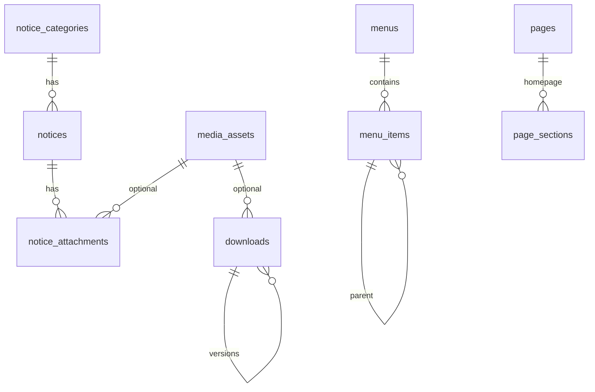

# Database Expansion — Phase B

**Baseline:** Phase 3.5 (39 + 6 CMS models)  
**Phase B adds:** 7 tables · 5 enums · `downloads` extensions · `PageSectionType` extensions

---

## New tables

### Notice Board (3 tables)

#### `notice_categories`
| Column | Type | Notes |
|--------|------|-------|
| id | UUID | PK |
| name | TEXT | |
| slug | TEXT | UNIQUE |
| description | TEXT | nullable |
| sort_order | INT | default 0 |
| is_active | BOOLEAN | default true |
| deleted_at | TIMESTAMPTZ | soft delete |

#### `notices`
| Column | Type | Notes |
|--------|------|-------|
| id | UUID | PK |
| title | TEXT | |
| slug | TEXT | UNIQUE per locale |
| category_id | UUID | FK → notice_categories |
| description | TEXT | |
| priority | INT | higher = more prominent |
| status | NoticeStatus | draft, scheduled, published, archived |
| is_pinned | BOOLEAN | |
| locale | ContentLocale | translation-ready |
| publish_at | TIMESTAMPTZ | schedule |
| expire_at | TIMESTAMPTZ | auto-hide |
| published_at | TIMESTAMPTZ | |
| created_by_id | UUID | |
| updated_by_id | UUID | |
| deleted_at | TIMESTAMPTZ | |

**Indexes:** `(slug, locale)`, `(status, publish_at, expire_at)`, `(is_pinned, priority)`

#### `notice_attachments`
| Column | Type | Notes |
|--------|------|-------|
| id | UUID | PK |
| notice_id | UUID | FK → notices CASCADE |
| media_asset_id | UUID | FK → media_assets (optional) |
| file_name | TEXT | |
| file_url | TEXT | |
| mime_type | TEXT | |
| size_bytes | INT | |
| sort_order | INT | |

---

### Global Settings (1 table)

#### `site_settings`
| Column | Type | Notes |
|--------|------|-------|
| id | UUID | PK |
| locale | ContentLocale | UNIQUE |
| organization_name | TEXT | |
| tagline | TEXT | |
| logo_url | TEXT | |
| favicon_url | TEXT | |
| contact_email | TEXT | |
| support_email | TEXT | |
| phone_numbers | JSONB | array |
| office_addresses | JSONB | array |
| social_links | JSONB | object |
| copyright_text | TEXT | |
| footer_content | JSONB | |
| registration_open | BOOLEAN | |
| maintenance_mode | BOOLEAN | |
| extra | JSONB | extensibility |

---

### Navigation (2 tables)

#### `menus`
| Column | Type | Notes |
|--------|------|-------|
| id | UUID | PK |
| name | TEXT | |
| slug | TEXT | UNIQUE per locale |
| menu_type | MenuType | header, footer, quick_links, mobile |
| locale | ContentLocale | |
| is_active | BOOLEAN | |
| deleted_at | TIMESTAMPTZ | |

#### `menu_items`
| Column | Type | Notes |
|--------|------|-------|
| id | UUID | PK |
| menu_id | UUID | FK → menus CASCADE |
| parent_id | UUID | self-ref for hierarchy |
| label | TEXT | |
| url | TEXT | |
| is_external | BOOLEAN | |
| open_in_new_tab | BOOLEAN | |
| icon | TEXT | nullable |
| sort_order | INT | |
| is_visible | BOOLEAN | |

---

### Announcement Bar (1 table)

#### `announcement_bars`
| Column | Type | Notes |
|--------|------|-------|
| id | UUID | PK |
| title | TEXT | |
| message | TEXT | |
| bar_type | AnnouncementBarType | global, registration_alert, etc. |
| color_theme | TEXT | default `primary` |
| cta_label | TEXT | nullable |
| cta_url | TEXT | nullable |
| locale | ContentLocale | |
| is_dismissible | BOOLEAN | |
| is_active | BOOLEAN | |
| priority | INT | |
| starts_at | TIMESTAMPTZ | |
| ends_at | TIMESTAMPTZ | |
| deleted_at | TIMESTAMPTZ | |

---

## Extended tables

### `downloads` (Phase B extensions)
| New column | Type |
|------------|------|
| slug | TEXT |
| download_type | DownloadType enum |
| tags | TEXT[] |
| version | INT |
| is_current | BOOLEAN |
| replaced_by_id | UUID (self-ref) |
| status | DownloadStatus enum |
| expires_at | TIMESTAMPTZ |
| media_asset_id | UUID → media_assets |

### `PageSectionType` enum (new values)
`counter`, `testimonial`, `partner`, `announcement`, `featured_events`, `featured_programs`

---

## New enums

| Enum | Values |
|------|--------|
| NoticeStatus | draft, scheduled, published, archived |
| DownloadType | brochure, report, guidelines, circular, poster, presentation, other |
| DownloadStatus | draft, published, archived |
| MenuType | header, footer, quick_links, mobile |
| AnnouncementBarType | global, registration_alert, deadline_reminder, emergency |

## AuditAction extensions
`notice_created`, `notice_updated`, `notice_published`, `notice_deleted`, `download_updated`, `settings_updated`, `menu_updated`, `announcement_bar_updated`

---

## SEO integration

All content modules write to existing `seo_metadata`:
- `entity_type`: `notice`, `download`, `page`
- Auto JSON-LD: NewsArticle (notices), WebPage (downloads, homepage)
- Sitemap: `/noticeboard`, `/downloads`, individual notice anchors

---

## Seed data (migration)

| Entity | Count |
|--------|-------|
| Notice categories | 4 (general, circulars, events, registration) |
| Site settings | 1 (en locale) |
| Menus | 3 (header, footer, quick-links) |

---

## Model count summary

| Phase | Models |
|-------|--------|
| Phase 2–3 | 39 |
| Phase 3.5 | +6 (Page, PageSection, PageRevision, SeoMetadata, MediaFolder, MediaAsset) |
| Phase B | +7 (NoticeCategory, Notice, NoticeAttachment, SiteSetting, Menu, MenuItem, AnnouncementBar) |
| **Total** | **52** |

---

## Relationship diagram

