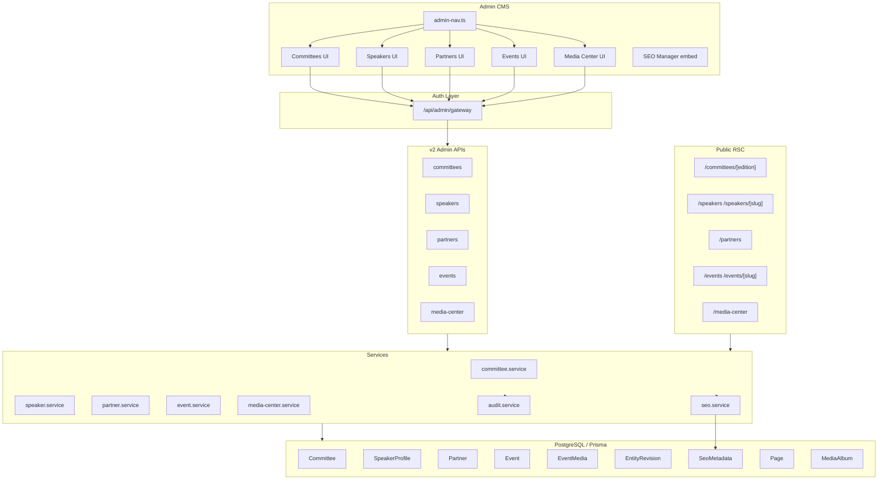

# Phase C Architecture — Organizational CMS Expansion

**Date:** May 2026  
**Status:** G3 APPROVED · Pre-work (no code yet)  
**Goal:** 95%+ of public website manageable via `/admin/cms`

---

## Constraints (unchanged)

| Constraint | Status |
|------------|--------|
| No Firebase migration | Active |
| No registration changes | Active |
| No Razorpay changes | Active |
| No Supabase cutover | Active |
| No deployment | Active |
| No abstract/paper/multitrack backends | Active |

---

## Current state (post-S2)

| Layer | Score (est.) | Gap for Phase C |
|-------|-------------|-----------------|
| Admin manageability | 92 | Committees, speakers, partners, events, media center have **API-only or hardcoded** public surfaces |
| SEO | 94 | Person/Event/Organization JSON-LD not wired to CMS entities |
| Global reach | 88 | Organizational entities lack `locale` columns |
| Production readiness | 92 | Admin UI missing for 3 of 5 modules |

### Existing assets to reuse

| Asset | Location | Phase C use |
|-------|----------|-------------|
| Admin shell | `AdminShell`, `AdminUi`, `admin-nav.ts` | All 5 modules |
| Admin gateway | `/api/admin/gateway/[...path]` | No new auth layer |
| SEO engine | `SeoMetadata` + `seo.service.ts` | Per-entity metadata |
| Audit logging | `audit.service.ts` | All mutations |
| Media library | `MediaAsset` + picker patterns | Photos, logos, banners |
| Page revisions pattern | `PageRevision` | Inspire generic `EntityRevision` |
| Committee service + API | `committee.service.ts`, `/api/v2/admin/committees/*` | Extend + admin UI |
| Event service + API | `event.service.ts`, `/api/v2/admin/events/*` | Extend + admin UI |
| Press articles | `Page` type `article` | Media Center: Press Releases category |
| Media albums | `MediaAlbum` (S2) | Media Center: Photo Galleries category |
| Downloads | `Download` | Event brochures, Publications |

### Hardcoded public surfaces (Phase C targets)

| Module | Public routes | Data source today |
|--------|---------------|-------------------|
| Committees | `/committees`, `/committee/*` (5 editions) | Inline TSX member arrays per edition |
| Speakers | `/keynotespeakers`, homepage highlights | `authority-speakers.ts`, `KeynoteSpeakers.tsx` |
| Partners | Homepage `partners` section, `Media_Partners.tsx` | CMS homepage JSON + static logos |
| Events | `/upcoming-events`, `UpcomingEvent.tsx` | Hardcoded component data |
| Media Center | `/media-center`, `/media/[edition]/...` | `data/media-archives.ts` |

---

## Architectural principles

1. **Extend, don't replace** — additive Prisma columns and enums only; no table drops.
2. **One admin architecture** — all modules under `/admin/cms/*` using `adminCmsFetch`.
3. **Server-first public pages** — RSC loaders + client islands only where interaction requires it.
4. **Fallback strategy** — every wired public route keeps hardcoded fallback until CMS content is published (same pattern as S2 press/legal).
5. **SEO via existing engine** — `upsertSeoForEntity(entityType, entityId, locale)`; no parallel metadata store.
6. **Revision via one generic table** — `EntityRevision` serves all five modules (avoid five revision tables).

---

## System diagram



---

## Module architecture summary

### Module 1 — Committees

**Reuse:** `Committee`, `CommitteeMember`, existing admin API routes.

**Extend:**
- Committee: `locale`, `edition`, `status` (PageStatus), `seo` via SeoMetadata
- CommitteeMember: `email`, `phone`, `socialLinks` (Json), `organization` alias for `institution`
- `CommitteeCategory` enum: add `Steering_Committee`, `National_Organizing_Committee`, `Event_Committee`
- Slug uniqueness: `@@unique([slug, edition, locale])` (replace global unique slug)

**Public:** Dynamic `/committee/[slug]` with CMS loader + legacy edition fallback.

**Admin:** `/admin/cms/committees` — list, create, member editor, reorder, publish.

---

### Module 2 — Speakers

**Reuse:** `SpeakerProfile` table.

**Extend:** `slug`, `locale`, `category`, `title`, `socialLinks` (Json), `edition`, `status` (PageStatus), `mediaAssetId` optional.

**New:** `speaker.service.ts`, admin/public APIs (none exist today).

**Public:** `/speakers` listing + `/speakers/[slug]` profile with Person JSON-LD.

**Admin:** `/admin/cms/speakers` — CRUD, featured toggle, bulk publish.

---

### Module 3 — Partners

**Reuse:** `Partner` table (not `Sponsor` — sponsors out of scope).

**Extend:** `description`, `isActive`, `locale`, `status`, `mediaAssetId`, `PartnerCategory` enum.

**New:** `partner.service.ts`, admin/public APIs.

**Public:** `/partners` directory; homepage reads published partners by category (fallback to homepage JSON).

**Admin:** `/admin/cms/partners` — CRUD, category filter, display order.

---

### Module 4 — Events

**Reuse:** `Event`, `event.service.ts`, admin API.

**Extend:** `locale`, `edition`, `category`, `startDate`, `endDate` (migrate from single `eventDate`), `highlights` (Json), `brochureDownloadId` (FK → Download), `publishAt`, `slug` per locale.

**Public:** `/events` catalog + `/events/[slug]` with Event schema.

**Admin:** `/admin/cms/events` — full catalog editor, brochure picker, schedule.

---

### Module 5 — Media Center

**Reuse (polymorphic hub, no new content table):**

| Category | Backing store |
|----------|---------------|
| Press Releases | `Page` (`pageType=article`) — S2 |
| Photo Galleries | `MediaAlbum` — S2 |
| News | Extended `EventMedia` |
| Media Mentions | Extended `EventMedia` |
| Videos | Extended `EventMedia` |
| Interviews | Extended `EventMedia` |
| Publications | `Download` or `EventMedia` type=document |

**Extend `EventMedia`** → canonical **media center entry** row:
- Add: `slug`, `locale`, `status`, `description`, `excerpt`, `tags[]`, `publishAt`, `edition`, `mediaCenterCategory` enum, `relatedEntityIds` (Json)

**Admin:** `/admin/cms/media-center` — unified inbox with category tabs; delegates to underlying store where appropriate (press → link to Articles admin).

**Public:** `/media-center` RSC loader aggregating published items across stores; fallback to `media-archives.ts`.

---

## Cross-cutting: EntityRevision

One new table for revision history (all modules):

```
EntityRevision {
  entityType: committee | committee_member | speaker | partner | event | media_entry
  entityId: UUID
  version: Int
  snapshot: Json
  createdById?: UUID
  createdAt: DateTime
}
```

Snapshot taken on every update/publish (same pattern as `saveRevision` in `page.service.ts`).

---

## Cross-cutting: Locale

Add `ContentLocale` (`en` | `hi`) to: Committee, CommitteeMember (optional inherit), SpeakerProfile, Partner, Event, EventMedia.

Public loaders accept locale from `[locale]` routes where applicable; organizational pages default `en` with Hindi rows seeded via `seed-phase-c-hi.mjs`.

---

## Implementation waves

| Wave | Scope | Validation |
|------|-------|------------|
| **C.0** | Migration + `EntityRevision` + enum extensions | `prisma migrate`, `tsc` |
| **C.1** | Committees admin UI + public wire + seed | 5 edition pages render |
| **C.2** | Speakers service/API/admin/public | Listing + profile SEO |
| **C.3** | Partners service/API/admin/homepage wire | Partner directory live |
| **C.4** | Events admin UI + public catalog | Event schema on pages |
| **C.5** | Media Center extension + unified admin + public hub | 7 categories browsable |
| **C.6** | Hindi seed + 6 completion docs + readiness audit | Score targets met |

---

## API surface (planned additions)

| Endpoint | Purpose |
|----------|---------|
| `GET/PATCH /api/v2/admin/committees/[id]` | Extend with status, locale, edition, SEO |
| `GET/POST/PATCH /api/v2/admin/speakers` | Full CRUD |
| `GET/POST/PATCH /api/v2/admin/partners` | Full CRUD |
| `GET/PATCH /api/v2/admin/events/[id]` | Extend fields + brochure |
| `GET/POST/PATCH /api/v2/admin/media-center` | Unified media entries |
| `GET /api/v2/committees` | Public published committees |
| `GET /api/v2/speakers` | Public speaker directory |
| `GET /api/v2/partners` | Public partners |
| `GET /api/v2/events` | Public event catalog |
| `GET /api/v2/media-center` | Aggregated public hub |

---

## Performance guardrails

- Paginated list endpoints (`limit`/`offset`, default 25)
- Public RSC: single loader per page, `Promise.all` for hub aggregation
- No N+1: `include` members/items in one query; hub uses grouped queries per store
- Lazy-load heavy client components (`MediaCenter` filters, speaker grid images)

---

## Security

- Reuse `requireAdmin` on all admin routes (existing `x-ops-secret` + Firebase gateway)
- No new RBAC matrix — same admin gate as S2
- Audit log on create/update/publish/delete/archive for all modules
- RLS unchanged (Supabase policies follow existing patterns)

---

## Success criteria mapping

| Criterion | Target | Phase C enablers |
|-----------|--------|------------------|
| Admin manageability | ≥ 95 | +5 admin modules, bulk actions, revision history |
| SEO | ≥ 95 | Person/Event/Organization/NewsArticle JSON-LD per entity |
| Global reach | ≥ 90 | Locale on all 5 modules + Hindi seed |
| Production readiness | ≥ 94 | Fallback strategy, migration, tsc, audit doc |

---

## Out of scope (explicit)

- Phase D, Firebase/registration migration, Razorpay, deploy
- Abstract/paper/multitrack submission backends
- Sponsor tier management (`Sponsor` table untouched)
- New admin architecture or auth system

---

**Next:** Implement per `PHASE_C_SCHEMA_REVIEW.md` → `PHASE_C_UI_PLAN.md` → `PHASE_C_SEO_PLAN.md`, then code in waves C.0–C.6.
