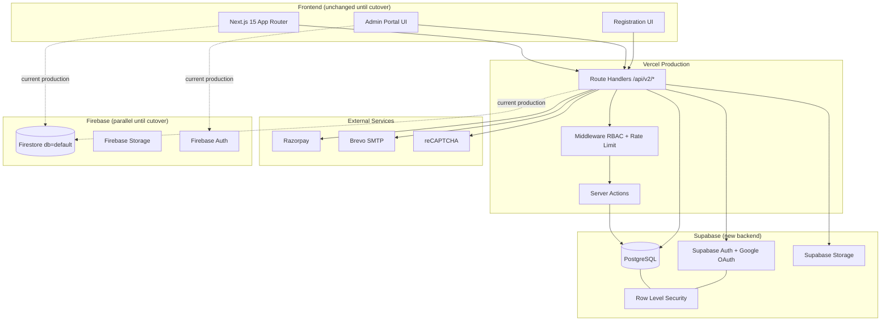
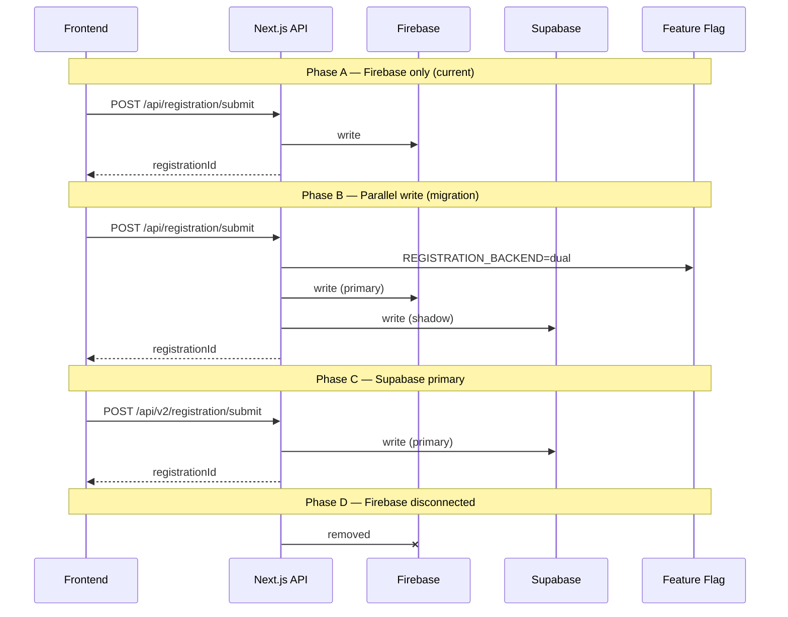

# 1. Architecture Diagram

## High-level system architecture

## Dual-write / cutover strategy

## Layer responsibilities

| Layer | Responsibility |
|-------|----------------|
| **Next.js Route Handlers** | HTTP API, validation, auth, rate limits |
| **Server Actions** | Admin mutations where form-post fits |
| **Prisma** | Type-safe DB access, transactions, migrations |
| **Supabase Auth** | Google OAuth, JWT, session refresh |
| **Supabase Storage** | File buckets, signed URLs, RLS |
| **PostgreSQL** | Source of truth post-cutover |
| **Zod** | Request/response validation |
| **Audit service** | Immutable activity log on every mutation |

## Registration engine flow

## Non-goals (explicit)

- Multitrack Conference module
- Abstract / Paper submission
- Reviewer / journal / proceedings workflows
- Manuscript management

Legacy Firebase collections for these remain read-only for migration reference only.
